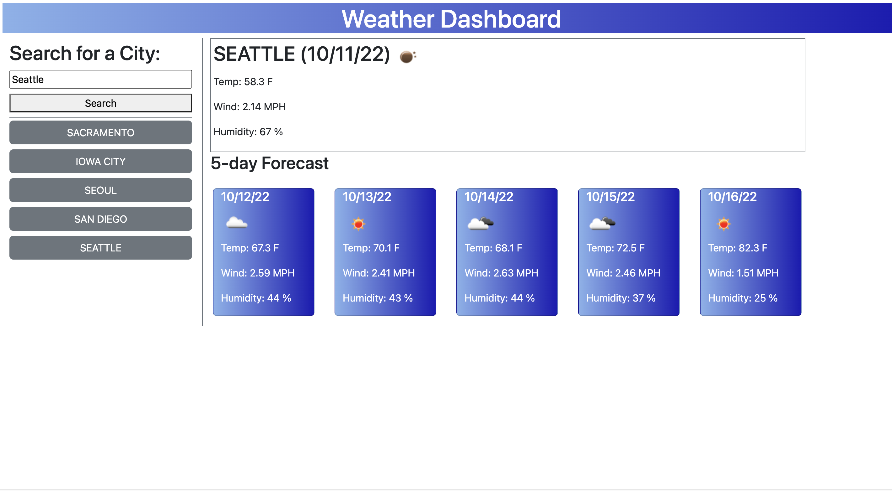

# weather-forecast

## Description 

This [Weather Forecast Website](mattdack.github.io/weather-forecast) allows users to search with a valid city name to be provided with a 5 day forecast for that city. The site utilizes the openweathermap geo and data api in order to gather the relevant weather information. Previous searches are stored in local storage and generate a button for users to reload data from that location. Event tracking enables the initial search and previous search buttons. Javascript dynamically updates the page with new weather data based on user interaction. The site is responsive to different view port sizes.

## Screenshot of Webpage

## Installation

There is no installation required or capable with this repository. Running the index.html file in a default browser renders a landing page to begin loading weather data.

## Usage 

Enter a valid city name in the location element and select search to load a 5 day forecast for that location. Select the grey buttons to the left in order to load weather forecasts from past search locations. Currently, searching cities with duplicative names, i.e. Eureka, will return the first city from the openweathermap geo api and do not allow the user to clarify the search selection.

## Credits

 Matthew Dacanay created the entirety of this webpage. Technical concepts and public resources were referred to as needed. You can find other projects by Matthew at his [github page](github.com/mattdack).